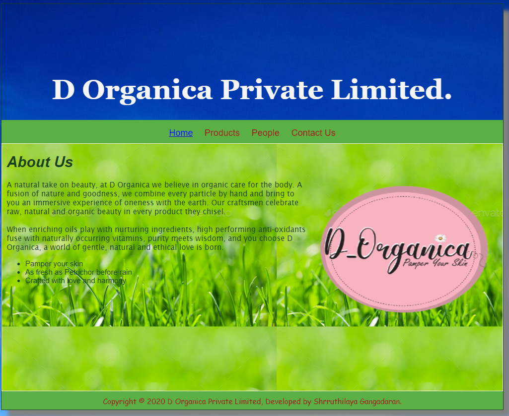
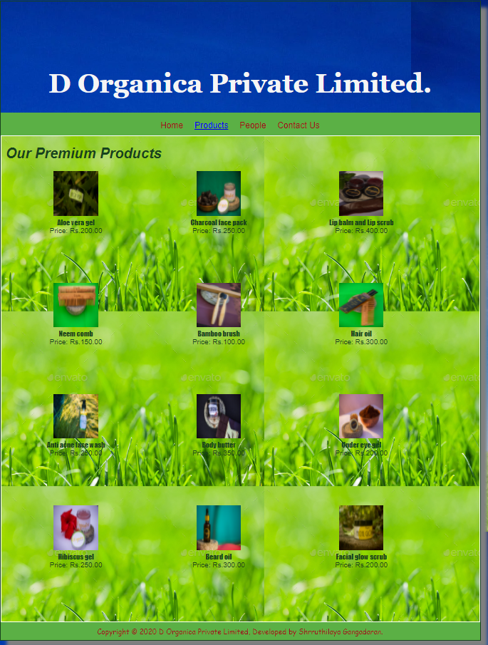
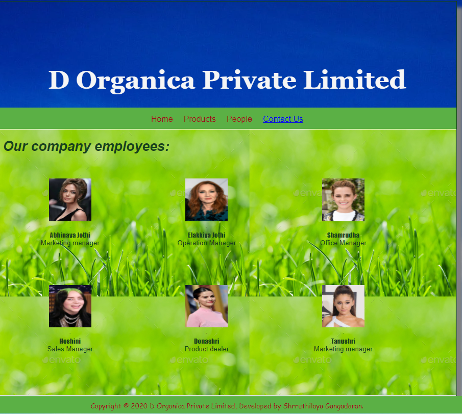
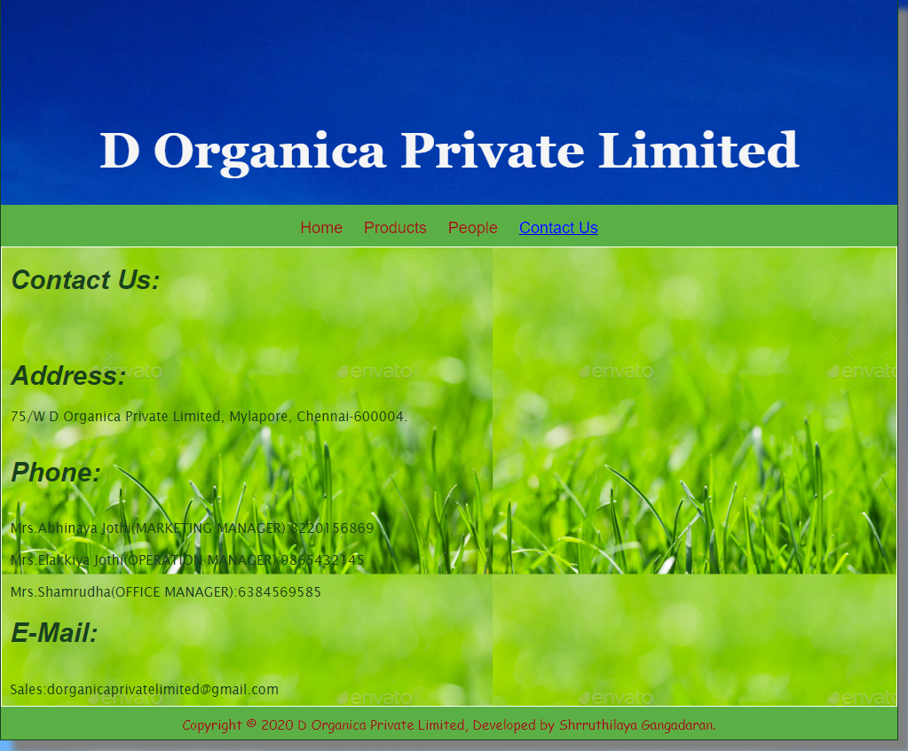

# Web Design for a Software Product Company

## AIM:

To design a static website for a software product company company.

## DESIGN STEPS:

### Step 1:

Requirement collection.

### Step 2:

Creating the layout using HTML and CSS.

### Step 3:

Updating the sample content.

### Step 4:

Choose the appropriate style and color scheme.

### Step 5:

Validate the layout in various browsers.

### Step 6:

Validate the HTML code.

### Step 6:

Publish the website in the given URL.

## PROGRAM :

### Layout :
~~~
* {
  box-sizing: border-box;
  font-family: Arial, Helvetica, sans-serif;
}
body {
  background-color: rgb(26, 29, 29);
  color: whitesmoke;
}
.container {
  width: 1080px;
  margin-left: auto;
  margin-right: auto;
  border-width: 1px 1px 1px 1px;
  border-style: solid;
  box-shadow: 15px 15px 8px gray;
}

.banner {
  display: block;
  width: 100%;
  height: 250px;
  text-align: center;
  font-size: 60px;
  font-family: Georgia, 'Times New Roman', Times, serif;
  font-weight: bold;
  background-size: 100% 100%;
  margin: 0px 0px 0px 0px;
  padding-top: 150px;
  color: whitesmoke;
}

.menu {
  display: block;
  width: 100%;
  height: 50px;
  font-size: larger;
  background-color: #5bb045;
  text-align: center;
  padding-top: 15px;
  margin: 0px 0px 0px 0px;
  border-width: 1px;
}

.menuitem {
  display: inline-block;
  margin-left: 10px;
  margin-right: 10px;
}
.menuitemselected {
  display: inline-block;
  margin-left: 10px;
  font-family: Verdana, Geneva, Tahoma, sans-serif;
  margin-right: 10px;
  color: #0d0f0f;
}

.menuitem a {
  text-decoration: none;
  color: #9c1018;
}

.content {
  display: block;
  width: 100%;
  background-image: url("https://t4.ftcdn.net/jpg/04/09/70/87/360_F_409708782_HxuxOH8f7xSmj5p4ygbAbuJE74vGGj2N.jpg");
  min-height: 500px;
  margin: 0px 0px 0px 0px;
  border-width: 1px;
  border-color: white;
  border-style: solid;
}
.homecontent {
  min-height: 500px;
  margin: 10px 10px 10px 10px;
}
.homecontent h1 {
  text-align: left;
  font-style: italic;
  font-family: sans-serif;
}
.homecontent img {
  float: right;
  width: 400px;
  height: 300px;
  margin-left: 10px;
}

.contenttext {
  text-align: left;
  font-family:'Lucida Sans', 'Lucida Sans Regular', 'Lucida Grande', 'Lucida Sans Unicode', Geneva, Verdana, sans-serif
}

.productcontent {
  min-height: 500px;
  margin: 10px 10px 10px 10px;
}

.productcontent h1 {
  text-align: left;
  font-style: italic;
  font-family: sans-serif;
}

.productitems {
  display: block;
}

.productitem {
  display: inline-block;
  width: 30%;
  height: 250px;
  text-align: center;
}

.productitem img {
  width: 100px;
  height: 100px;
  display: block;
}
.productitem .itemimage {
  display: block;
  margin-left: auto;
  margin-right: auto;
  width: 100px;
  margin-bottom: 5px;
}

.productitem .itemname {
  display: block;
  font-family: Impact, Haettenschweiler, 'Arial Narrow Bold', sans-serif;
}
.productitem .itemprice {
  display: block;
}

.footer {
  display: block;
  width: 100%;
  height: 40px;
  background-color: #5bb045;
  text-align: center;
  font-family: cursive;
  padding-top: 10px;
  margin: 0px 0px 0px 0px;
  color: #9c1018;
}

~~~

### Home Page:
~~~
<!DOCTYPE html>
<html lang="en">
  <head>
    <title>FrivLee Clipzee</title>
    <link rel="stylesheet" href="./css/layout.css" />
    <link rel="icon" href="./img/icon.png" type="image/x-icon" />
  </head>

  <body>
    

      
FrivLee Clipzee

      

        
<a href="/static/home.html">Home</a>

        
<a href="/static/products.html">Products</a>

        
<a>People</a>

        
<a>Contact Us</a>

      

      

        

          <h1>About Us</h1>
          
          

            Internet gaming can be a safe and enjoyable online activity if your educate yourself and
            practice the basic principles of good computer security. Many computer security principles
            are the same as those you may have practiced in other computer applications.
              
            Altogether, playing online games help players develop complex problem-solving skills,
            leadership skills, and the ability to deal better with unexpected consequences. They also
            enhance a player's skills of observation, intuitive abilities, and hone their alertness and
            concentration.
            
            <ul>
              <li>Refresh your mind</li>
              <li>Endless Entertainment</li>
              <li>Safe International gaming</li>
            </ul>
          

        

      

      

        Copyright &#169; 2021 FrivLee Clipzee, Developed by Shrruthilaya Gangadaran.
      

    

  </body>
</html>

~~~

### Product Page:
~~~
<!DOCTYPE html>
<html lang="en">
  <head>
    <title>FrivLee Clipzee</title>
    <link rel="stylesheet" href="./css/layout.css" />
    <link rel="icon" href="./img/icon.png" type="image/x-icon" />
  </head>

  <body>
    

      
FrivLee Clipzee

      

        
<a href="/static/home.html">Home</a>

        

          <a href="/static/products.html">Products</a>
        

        
<a>People</a>

        
<a>Contact Us</a>

      

      

        
    
          <h1>Our Best Games For Kids:</h1>
          

              
 
                  

                  
                  

                  
Haunt the house

                  
Price: Rs.190.00 

              

              
 
                  

                  
                  

                  
Vampire skills

                  
Price: Rs.210.00 

              

              
 
                  

                  
                  

                  
Rachel's cake

                  
Price: Rs.190.00 

              

              
 
                  

                  
                  

                  
Fire boy and Water girl-Light temple

                  
Price: Rs.150.00 

              

              
 
                    

                    
                    

                    
Fire boy and Water girl-Ice temple

                    
Price: Rs.150.00 

                

                
 
                  

                    
                    

                    
Fire boy and Water girl-Crystal temple

                    
Price: Rs.150.00 

                

                
 
                  

                  
                  

                  
Death chase

                  
Price: Rs.250.00 

               

               
 
                  

                  
                  

                  
Coco monkey

                  
Price: Rs.190.00 

               

               
 
                  

                  
                  

                  
Break the glass

                  
Price: Rs.150.00 

               

               
 
                  

                  
                  

                  
Robo hero-Red zone

                  
Price: Rs.150.00 

               

               
 
                  

                  
                  

                  
Robo hero-Green zone

                  
Price: Rs.150.00 

               

               
 
                  

                  
                  

                  
Robo hero-Blue zone

                  
Price: Rs.150.00 

                

               
          

          
        
      

      

        Copyright &#169; 2021 FrivLee Clipzee, Developed by Shrruthilaya Gangadaran.
      

    

  </body>
</html>

~~~

### People Page:
~~~
<!DOCTYPE html>
<html lang="en">
  <head>
    <title>FrivLee Clipzee</title>
    <link rel="stylesheet" href="./css/layout.css" />
    <link rel="icon" href="./img/ail.png" type="image/x-icon" />
    </head>
    <body>
    

      
FrivLee Clipzee

      

        
<a href="/static/home.html">Home</a>

        
<a href="/static/products.html">Products</a>

        
<a href="/static/people.html">People</a>

        
<a href="/static/contactus.html">Contact Us</a>

        

      

        

          <h1>Foundation team:</h1>  
            
 
                

                .
                

                
Shrruthilaya Gangadaran

                
Founder

            

            
 
                

                .
                

                
Lizaa

                
CEO

            

            
 
               

               .
               

               
Ishwarya

               
CFO

            

            
 
                

                .
                

                
Hoshini

                
CTO

             

             
 
                

                .
                

                
Donashri

                
Team lead of Software development

             

             
 
                

                .
                

                
Tanushri

                
Head of Creative department

             

          

        
        
      

      

      Copyright &#169; 2021 FrivLee Clipzee, Developed by Shrruthilaya Gangadaran.
      

     

   </body>
  </html>
~~~

### Contact Us Page:
~~~
<!DOCTYPE html>
<html lang="en">
  <head>
    <title>FrivLee Clipzee</title>
    <link rel="stylesheet" href="./css/layout.css" />
    <link rel="icon" href="./img/ail.png" type="image/x-icon" />
  </head>

  <body>
    

      
FrivLee Clipzee

      

        
<a href="/static/home.html">Home</a>

        
<a href="/static/products.html">Products</a>

        
<a href="/static/people.html">People</a>

        
<a href="/static/contactus.html">Contact Us</a>

      

      

        

          <h1>Contact Us:</h1>  
          <h1>Address:</h1>
          

            75/W FrivLee Clipzee, Chicago, US.
          
 
          <h1>Phone:</h1> 
          

              Ms.Hoshini(CTO):  
              Ms.Donashri(Team lead of Software development):9865432145  
              Ms.Tanushri(Head of Creative department):6384569585
          

          <h1>E-Mail:</h1> 
          

              Games:frivleeclipzee@gmail.com
          

        

      

      

        Copyright &#169; 2021  FrivLee Clipzee, Developed by Shrruthilaya Gangadaran.
      

    

  </body>
</html>
~~~

## OUTPUT:

### Home Page:

### Product Page:

### People Page:

### Contact Us Page:

## Result:

Thus a website is designed for the software product company and the HTML,CSS code are validated.
